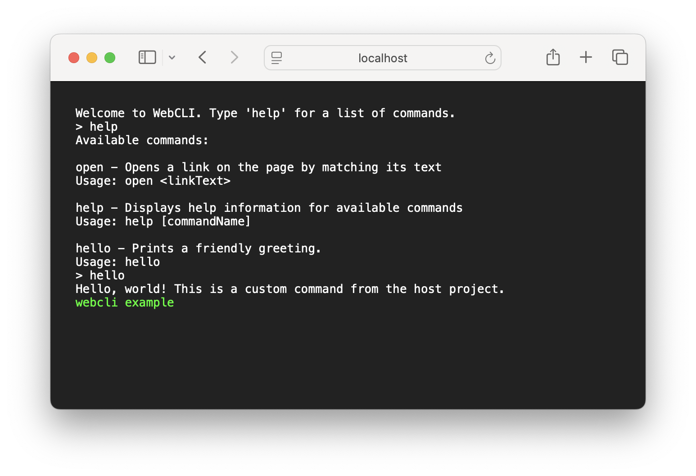

# WebCLI

WebCLI is a simple CLI-like navigation tool for websites that listens to keyboard events, accepts command input, and executes commands. Its modular architecture makes it easy to add new commands by defining them in separate files.

[See example project here](https://metervara.github.io/web-cli/examples/)



## Features

- **Modular Commands:** Each command is defined in its own file.
- **DOM-based Terminal:** Both input and output are rendered directly in the DOM.
- **Custom Commands:** Extend the CLI by simply adding new command modules.

## Getting Started

### Using WebCLI in Your Project

1. **Installation**

Add WebCLI as a dependency in your project's `package.json`:

´´´json
"dependencies": {
  "@metervara/webcli": "git+https://github.com/metervara/web-cli.git#[VERSION]"
}
´´´

Replace `[VERSION]` with the desired tag (e.g., `v1.0.2`). Then run your package manager's install command (e.g., `npm install`).

2. **Import and Usage**

In your project, import the CLI and create an instance:

```js
import { CLI } from '@metervara/webcli';

const cli = new CLI();
// Set up cli for your case, please see example in the repo
// Optionally, execute a command (e.g., "hello")
cli.execute('help');
```

### Local development and testing

1. **Clone the repository:**

   ```bash
   git clone https://github.com/metervara/web-cli.git
   cd webcli
   ```

2. **Install dependencies:**

   ```bash
   npm install
   ```

3. **Build the project:**

   ```bash
   npm run build
   ```

### Running the Example

To serve the example locally run (make sure you build first):

```bash
npm run start
```

Then open the an example URL in your browser (e.g http://localhost/docs/index.html)

## Usage

- **Input:** Type your command into the terminal displayed on the webpage.
- **Execution:** Press `Enter` to execute the command.
- **Commands:**
  - `help`: Displays help information about available commands.
  - `open <linkText>`: Opens a link on the page whose text matches `<linkText>`.

## Extending WebCLI

To add a new command:
1. Create a new file in the commands folder following the `Command` interface defined in the project.
2. Register the new command in the main file where the CLI instance is created.

## License

This project is licensed under the MIT License.
